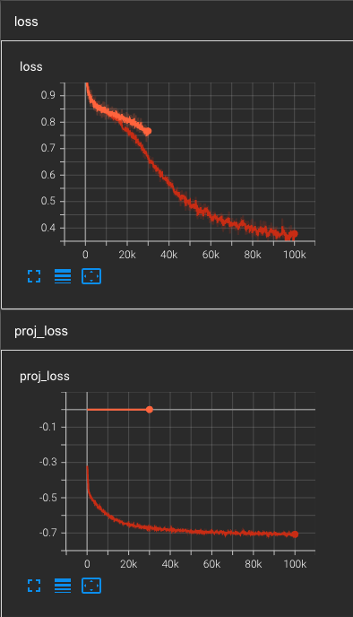
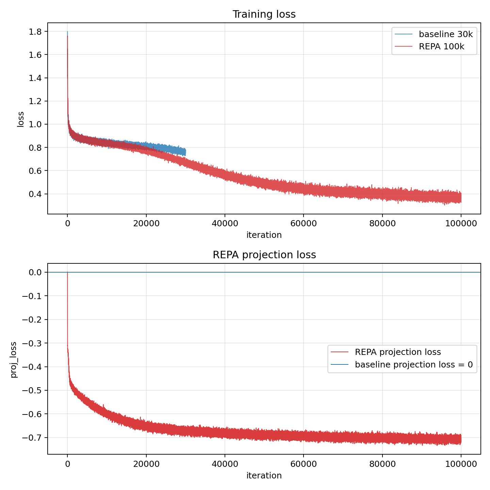
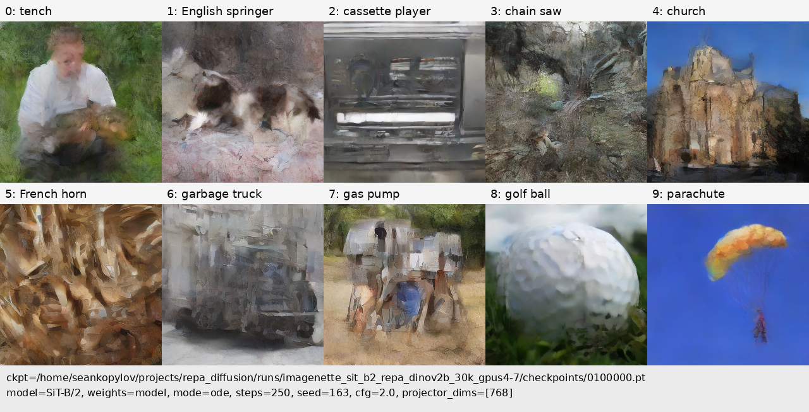
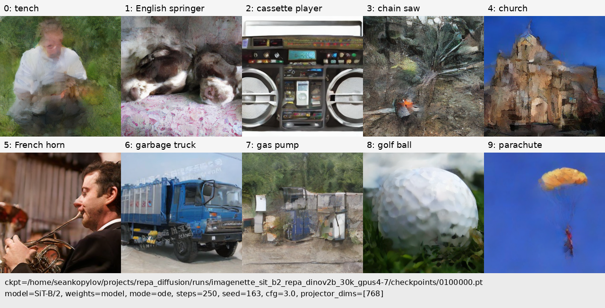
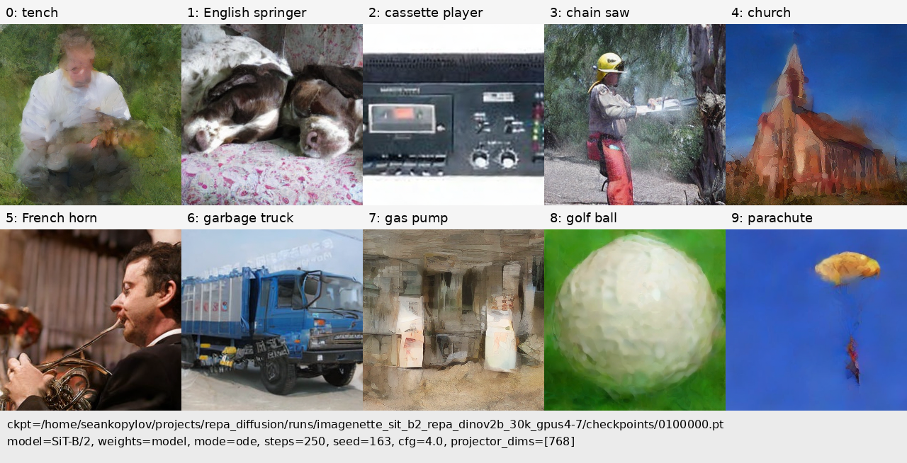
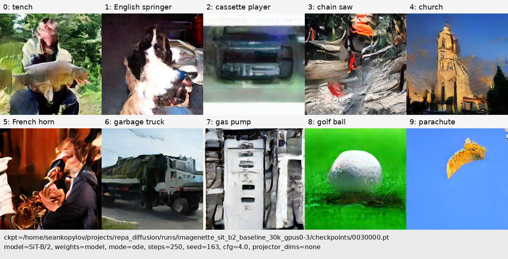
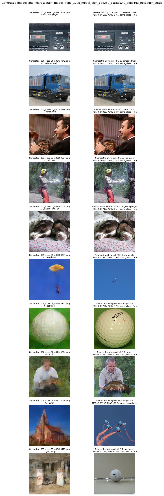

# REPA-Diffusion
Research project studying **REPresentation Alignment (REPA)** in diffusion transformers under constrained data and compute.

**Core question:** Does REPA remain a training accelerator when the model is trained on a small dataset (Imagenette, ~9k images), and what happens to generation quality at high guidance scales?

This repository hosts project scripts, experiment logs, sample outputs, and documentation. The REPA implementation lives in the [`REPA/`](REPA/) submodule — a fork of [sihyun-yu/REPA](https://github.com/sihyun-yu/REPA) with several patches for this project.

---

## Current Status (May 2026)

Two main experiments are complete on Imagenette (10 classes, 256×256):

| Run | Steps | Status |
|---|---|---|
| Baseline SiT-B/2 (no REPA) | 30 000 | Done |
| REPA SiT-B/2 + DINOv2-B | 100 000 | Done |
| Baseline SiT-B/2 (no REPA) | 100 000 | **Planned / In progress** |

### Training Loss Curves

REPA loss goes down faster than baseline. The projection loss (`proj_loss`) drops sharply in the first 30k steps and then plateaus around −0.7, while the denoising loss continues to fall steadily from ~0.9 to ~0.4 over 100k steps.



<!--  -->

---

### Generated Samples — REPA 100k

With **cfg=4**, images look sharp and visually correct. With lower guidance (cfg=2, cfg=3), generated images are more diverse but less class-consistent.

**REPA 100k · cfg=2**



**REPA 100k · cfg=3**



**REPA 100k · cfg=4**



---

### Generated Samples — Baseline 30k

At the same training budget of 30k steps, the no-REPA baseline already produces recognizable images when cfg=4 is used:



---

### The Memorization Problem ⚠️

**With cfg=4, the images look great — but they are effectively replaying training data.**

At 100k steps on only ~9 469 training images (Imagenette), the model has seen each image approximately **2 700 times**. A nearest-neighbour pixel audit reveals that the generated images at high guidance strength closely match specific training-set images:




**Why this happens and why it matters:**

Classifier-free guidance (CFG) amplifies the conditional signal at the cost of diversity. The formula is:

```
score_guided = score_uncond + cfg_scale * (score_cond - score_uncond)
```

A high `cfg_scale` pushes the sampler toward the sharpest, most class-consistent outputs the model has memorized — which on a dataset this small means the model converges on near-copies of training images rather than generalized representations.

This is not a bug in REPA — it is a fundamental small-data overfitting problem. The diffusion model memorises training examples instead of learning a generalizable data distribution. REPA may even amplify this because the DINOv2 teacher provides strong visual priors that help the model lock onto real image patches faster.

**Nearest-train-image comparisons at 80k and 100k checkpoints:**


**Takeaway:** To draw meaningful conclusions about REPA's generalization benefit, we need either a larger dataset (ImageNet-100, Stanford Cars) or a shorter training budget that prevents full memorization. The baseline 30k comparison at matched steps is a cleaner experiment because it stays in the under-memorized regime.

---

## Repository Layout

```
repa_diffusion/
├── README.md                        ← this file
├── AGENT_NOTES.md                   ← detailed research notes
├── main.pdf                         ← project proposal
├── nearest_train_image_audit.ipynb  ← memorization audit notebook
├── .gitmodules
│
├── REPA/                            ← git submodule (forked REPA implementation)
│   ├── train.py                     ← main training entry-point
│   ├── generate.py                  ← class-conditional sampling
│   ├── loss.py                      ← REPA + denoising loss
│   ├── samplers.py                  ← ODE/SDE Euler samplers
│   ├── models/sit.py                ← SiT-B/2 model
│   └── preprocessing/               ← VAE encoding utilities
│
├── scripts/                         ← project experiment scripts
│   ├── run_imagenette_baseline.sh              ← multi-GPU baseline wrapper
│   ├── run_imagenette_repa.sh                  ← multi-GPU REPA wrapper
│   ├── run_imagenette_baseline_1gpu.sh         ← single-GPU baseline (3080)
│   ├── run_imagenette_repa_1gpu.sh             ← single-GPU REPA (3080)
│   ├── launch_imagenette_baseline_30k_gpus0-3.sh  ← nohup launcher for 30k baseline
│   ├── launch_imagenette_repa_30k_gpus4-7.sh     ← nohup launcher for 30k→100k REPA
│   ├── launch_imagenette_repa_50k_to_100k_gpus0-5.sh  ← nohup continuation
│   ├── generate_imagenette_samples.sh          ← sampling wrapper
│   ├── generate_labeled_imagenette_grid.py     ← labeled sample grid generator
│   ├── make_sample_grid.py                     ← contact-sheet builder
│   ├── show_imagenette_30k_progress.sh         ← training progress reader
│   ├── start_tensorboard.sh                    ← TensorBoard launcher
│   ├── run_stanford_cars_baseline.sh           ← Stanford Cars baseline
│   ├── run_stanford_cars_repa.sh               ← Stanford Cars REPA
│   ├── export_stanford_cars_for_repa.py        ← HF → REPA dataset export
│   ├── celeba.py                               ← CelebA Dataset class
│   ├── export_celeba_for_repa.py               ← CelebA → REPA dataset export
│   ├── run_celeba_baseline.sh                  ← CelebA baseline training
│   ├── run_celeba_repa.sh                      ← CelebA REPA training
│   ├── lsunchurch.py                           ← LSUN Church Dataset class
│   ├── export_lsunchurch_for_repa.py           ← LSUN Church → REPA dataset export
│   ├── run_lsunchurch_baseline.sh              ← LSUN Church baseline training
│   ├── run_lsunchurch_repa.sh                  ← LSUN Church REPA training
│   ├── compcars.py                             ← CompCars Dataset class
│   ├── export_compcars_for_repa.py             ← CompCars → REPA dataset export
│   ├── run_compcars_baseline.sh                ← CompCars baseline training
│   └── run_compcars_repa.sh                    ← CompCars REPA training
│
├── logs/                            ← stdout training logs (gitignored)
│   ├── train_baseline_30k_gpus0-3.log
│   ├── train_repa_30k_gpus4-7.log
│   ├── train_repa_continue_30k_to_100k_gpus0-5.log
│   └── train_repa_continue_50k_to_100k_gpus0-5.log
│
├── runs/                            ← experiment outputs (gitignored)
│   ├── imagenette_sit_b2_baseline_30k_gpus0-3/
│   │   ├── args.json
│   │   ├── log.txt
│   │   ├── checkpoints/0030000.pt
│   │   └── logs/REPA/              ← TensorBoard event files
│   └── imagenette_sit_b2_repa_dinov2b_30k_gpus4-7/
│       ├── args.json
│       ├── log.txt
│       ├── checkpoints/0100000.pt
│       └── logs/REPA/
│
├── samples/                         ← generated sample PNGs (gitignored)
│   ├── baseline_30k_model_cfg4_ode250_classes0-9_seed163/
│   └── repa_100k_model_cfg{2,3,4}_ode250_classes0-9_seed163_notebook_setup/
│
├── reports/                         ← analysis artifacts
│   └── nearest_train_pixel_audit/
│
└── docs/assets/                     ← committed images used in this README
```

---

## Full Pipeline: From Scratch to Results

### 0. Clone the Repository

```bash
git clone https://github.com/pakhomovee/REPA-diffusion.git repa_diffusion
cd repa_diffusion
git submodule update --init --recursive
```

### 1. Python Environment

```bash
python -m venv .venv
source .venv/bin/activate
pip install -r REPA/requirements.txt
# TensorBoard workaround for setuptools ≥81
pip install "setuptools<81" --force-reinstall
```

### 2. Prepare the Dataset (Imagenette)

Download and preprocess Imagenette into the REPA-expected format (raw images + SD-VAE latents):

```bash
# Download raw Imagenette-320
wget https://s3.amazonaws.com/fast-ai-imageclas/imagenette2-320.tgz -P data/downloads/
tar -xzf data/downloads/imagenette2-320.tgz -C data/raw/

# Preprocess to 256×256 PNGs + SD-VAE latents using REPA preprocessing
python REPA/preprocessing/encoders.py \
  --data_path data/raw/imagenette2-320/train \
  --output_path data/imagenette256-train \
  --resolution 256

python REPA/preprocessing/encoders.py \
  --data_path data/raw/imagenette2-320/val \
  --output_path data/imagenette256-val \
  --resolution 256
```

After preprocessing the directory structure must be:

```
data/imagenette256-train/
├── images/
│   ├── dataset.json
│   └── 00000/img00000000.png ...
└── vae-sd/
    ├── dataset.json
    └── 00000/img-mean-std-00000000.npy ...
```

### 3. Training

#### Option A — Multi-GPU Server (e.g., 4× A100)

**Baseline (no REPA), 30k steps:**

```bash
CUDA_VISIBLE_DEVICES=0,1,2,3 \
NUM_PROCESSES=4 \
BATCH_SIZE=256 \
MAX_TRAIN_STEPS=30000 \
CHECKPOINTING_STEPS=5000 \
EXP_NAME=imagenette_sit_b2_baseline_30k \
./scripts/run_imagenette_baseline.sh > logs/train_baseline_30k.log 2>&1
```

**REPA (DINOv2-B teacher), 100k steps:**

```bash
CUDA_VISIBLE_DEVICES=0,1,2,3 \
NUM_PROCESSES=4 \
BATCH_SIZE=256 \
MAX_TRAIN_STEPS=100000 \
CHECKPOINTING_STEPS=10000 \
EXP_NAME=imagenette_sit_b2_repa_100k \
./scripts/run_imagenette_repa.sh > logs/train_repa_100k.log 2>&1
```

**To run both experiments simultaneously** on 8 GPUs:

```bash
./scripts/launch_imagenette_baseline_30k_gpus0-3.sh   # uses GPUs 0-3
./scripts/launch_imagenette_repa_30k_gpus4-7.sh        # uses GPUs 4-7
```

**To continue REPA from a saved checkpoint** (e.g., resume at 50k → 100k):

```bash
./scripts/launch_imagenette_repa_50k_to_100k_gpus0-5.sh
```

#### Option B — Single GPU (RTX 3080 / 10–12 GB VRAM)

The 3080 scripts use gradient accumulation to keep the effective batch at 256:

**Baseline** (local batch 32 × accum 8 = effective 256):

```bash
CUDA_VISIBLE_DEVICES=0 \
MAX_TRAIN_STEPS=30000 \
EXP_NAME=imagenette_baseline_1gpu \
./scripts/run_imagenette_baseline_1gpu.sh > logs/train_baseline_1gpu.log 2>&1
```

**REPA** (local batch 16 × accum 16 = effective 256; DINOv2-B adds ~1.5 GB VRAM):

```bash
CUDA_VISIBLE_DEVICES=0 \
MAX_TRAIN_STEPS=100000 \
EXP_NAME=imagenette_repa_1gpu \
./scripts/run_imagenette_repa_1gpu.sh > logs/train_repa_1gpu.log 2>&1
```

If you get OOM errors reduce `LOCAL_BATCH` and increase `ACCUM_STEPS` proportionally.

### 4. Sampling

```bash
bash scripts/generate_imagenette_samples.sh \
  runs/imagenette_sit_b2_repa_100k/checkpoints/0100000.pt \
  --cfg-scale 4 --num-sampling-steps 250
```

### 5. Monitor Training

```bash
./scripts/start_tensorboard.sh
```

---

## Forked REPA: Patches Applied

The `REPA/` submodule is a fork of [sihyun-yu/REPA](https://github.com/sihyun-yu/REPA) with the following project-specific patches:

| Change | File(s) |
|---|---|
| True baseline mode: `--enc-type none` skips teacher entirely | `train.py`, `loss.py` |
| Non-ImageNet class counts via `--num-classes` | `train.py` |
| CFG null-class fix for small class counts in samplers | `samplers.py` |
| Per-step timing logs (`step_time`, `teacher_time`) | `train.py` |
| TensorBoard tracker support (`--report-to tensorboard`) | `train.py` |
| `--projector-embed-dims none` for baseline checkpoint generation | `generate.py` |
| `weights_only=False` checkpoint loading for PyTorch 2.6 | `train.py`, `generate.py` |
| Safer checkpoint save via `accelerator.unwrap_model()` | `train.py` |
| `--no-sample-at-step-one` flag | `train.py` |

---

## Stanford Cars (Future Experiment)

Stanford Cars (196 classes, 8 144 train / 8 041 test images) is prepared for the next phase: testing whether REPA improves fine-grained vehicle generation or over-regularizes narrow classes.

Dataset preparation:

```bash
# Download from Hugging Face (original Stanford URLs are dead)
python scripts/export_stanford_cars_for_repa.py
# Then preprocess with REPA VAE encoder (same as Imagenette)
```

Training uses `--num-classes=196` with the same SiT-B/2 + DINOv2-B setup.

---

## CelebA Dataset

CelebA (202 599 face images, 40 binary attributes) is used for class-conditional generation experiments. Classes are defined by a bitmask over a configurable subset of binary attributes (default: `Male`, `Smiling`, `Young`, `Attractive` → **16 classes**).

### Prerequisites

Install extra dependencies if not already present:
```bash
pip install gdown natsort
```

### Step 0 — Clone (with submodule)
```bash
git clone --recurse-submodules https://github.com/pakhomovee/REPA-diffusion.git
cd REPA-diffusion
git checkout celeba
git submodule update --init --recursive
pip install -r REPA/requirements.txt
pip install gdown natsort
```

### Step 1 — Export CelebA images

Downloads the dataset automatically from Google Drive (if absent) and exports it to the REPA image-folder format with a `dataset.json`:

```bash
python scripts/export_celeba_for_repa.py
```

This creates `data/celeba256/images/` (256×256 centre-cropped JPEGs) and `data/celeba256/dataset.json`.

**Optional overrides:**
```bash
python scripts/export_celeba_for_repa.py \
  --root-dir /path/to/raw/celeba \
  --output-dir /path/to/celeba256 \
  --selected-attrs Male Smiling Young \
  --resolution 256
```

> `--selected-attrs` controls which binary attributes define the class label.  
> Number of classes = 2^(number of selected attributes).

### Step 2 — Encode VAE latents

REPA trains on precomputed SD-VAE latents, not raw pixels:

```bash
cd REPA/preprocessing
python dataset_tools.py encode \
    --source ../../data/celeba256 \
    --dest ../../data/celeba256/vae-sd \
    --model-url stabilityai/sd-vae-ft-mse
cd ../..
```

Expected output layout after both steps:
```
data/celeba256/
    images/          <- raw 256x256 JPEGs
    vae-sd/          <- .npy latents + dataset.json
    dataset.json     <- top-level labels
```

### Step 3 — Training

**Baseline (no REPA alignment):**
```bash
bash scripts/run_celeba_baseline.sh
```

**REPA with DINOv2-B encoder:**
```bash
bash scripts/run_celeba_repa.sh
```

Both scripts default to 6 GPUs. Override via environment variables:
```bash
NUM_PROCESSES=1 \
CUDA_VISIBLE_DEVICES=0 \
BATCH_SIZE=64 \
MAX_TRAIN_STEPS=50000 \
CHECKPOINTING_STEPS=5000 \
EXP_NAME=celeba_test \
bash scripts/run_celeba_repa.sh
```

If you used non-default `--selected-attrs` in Step 1, pass the matching class count:
```bash
NUM_CLASSES=8 bash scripts/run_celeba_repa.sh   # e.g. 3 attributes -> 2^3=8
```

### Step 4 — Monitor
```bash
./scripts/start_tensorboard.sh
```

### CelebA Configuration

| Parameter | Value |
|-----------|-------|
| Model | SiT-B/2 |
| Resolution | 256×256 |
| Default attributes | Male, Smiling, Young, Attractive |
| Num classes (default) | 16 (= 2⁴) |
| REPA teacher | DINOv2-ViT-B |
| REPA proj coeff | 0.5 |
| Default max steps | 100 000 |

---

## LSUN Church Dataset

LSUN Church-Outdoor is a large-scale **unconditional** scene generation benchmark. Since it carries no semantic class labels, it is exported with a single class (`--num-classes=1`), making it an ideal test bed for studying whether REPA's representation alignment improves sample quality on natural-scene data without class conditioning.

Kaggle source: [ajaykgp12/lsunchurch](https://www.kaggle.com/datasets/ajaykgp12/lsunchurch)

### Prerequisites

```bash
pip install kagglehub natsort   # kagglehub enables auto-download
```

### Step 1 — Export LSUN Church images

```bash
python scripts/export_lsunchurch_for_repa.py
```

This creates `data/lsun_church256/images/` (256×256 centre-cropped JPEGs) and `data/lsun_church256/dataset.json`.

**Optional overrides:**
```bash
python scripts/export_lsunchurch_for_repa.py \
  --root-dir  data/lsun_church \
  --output-dir data/lsun_church256 \
  --resolution 256 \
  --max-images 50000   # cap export for quick tests
```

> If Kaggle credentials are configured, `LSUNChurchDataset` will auto-download via `kagglehub`.  
> Otherwise, download the dataset manually and extract it into `data/lsun_church/`.

### Step 2 — Encode VAE latents

```bash
cd REPA/preprocessing
python dataset_tools.py encode \
    --source ../../data/lsun_church256 \
    --dest ../../data/lsun_church256/vae-sd \
    --model-url stabilityai/sd-vae-ft-mse
cd ../..
```

Expected output layout:
```
data/lsun_church256/
    images/          <- 256×256 JPEGs
    vae-sd/          <- .npy latents + dataset.json
    dataset.json     <- all labels = 0 (unconditional)
```

### Step 3 — Training

**Baseline (no REPA alignment):**
```bash
bash scripts/run_lsunchurch_baseline.sh
```

**REPA with DINOv2-B encoder:**
```bash
bash scripts/run_lsunchurch_repa.sh
```

Both scripts default to 6 GPUs (`CUDA_VISIBLE_DEVICES=0,1,2,3,4,5`). Override via environment variables:
```bash
NUM_PROCESSES=2 \
CUDA_VISIBLE_DEVICES=0,1 \
BATCH_SIZE=128 \
MAX_TRAIN_STEPS=50000 \
CHECKPOINTING_STEPS=5000 \
EXP_NAME=lsunchurch_test \
bash scripts/run_lsunchurch_repa.sh
```

### Step 4 — Monitor
```bash
./scripts/start_tensorboard.sh
```

### LSUN Church Configuration

| Parameter | Value |
|-----------|-------|
| Model | SiT-B/2 |
| Resolution | 256×256 |
| Num classes | 1 (unconditional) |
| REPA teacher | DINOv2-ViT-B |
| REPA proj coeff | 0.5 |
| Default max steps | 100 000 |
| Accelerate port (baseline) | 29523 |
| Accelerate port (REPA) | 29524 |

---

## CompCars Dataset

CompCars (web-nature sub-set) contains fine-grained car images organized by **make** and **model**, making it a natural counterpart to Stanford Cars for studying REPA on fine-grained recognition tasks. Classes are assigned at the **(make × model)** level; with the default `--min-class-size=10` filter approximately **1 600 classes** survive, giving a much richer conditioning signal than Stanford Cars (196 classes).

Kaggle source: [renancostaalencar/compcars](https://www.kaggle.com/datasets/renancostaalencar/compcars)

### Prerequisites

```bash
pip install kagglehub natsort
```

### Step 1 — Export CompCars images

```bash
python scripts/export_compcars_for_repa.py
```

The script prints the final `--num-classes` value — **note it down** and use it in Steps 3–4.

**Optional overrides:**
```bash
python scripts/export_compcars_for_repa.py \
  --root-dir  data/compcars \
  --output-dir data/compcars256 \
  --resolution 256 \
  --min-class-size 10   # drop classes with fewer than 10 images; set to 1 to keep all
```

> The `--min-class-size` filter removes very rare make/model combinations that would be impossible to learn. Increase it to reduce class count; set to `1` to keep every class.

Output layout:
```
data/compcars256/
    000-<make>_<model>/
        000000.jpg
        000001.jpg
        ...
    001-<make>_<model>/
        ...
    dataset.json    <- {"labels": [["000-…/000000.jpg", 0], ...]}
    classes.json    <- {0: "<make>_<model>", 1: ..., ...}
```

### Step 2 — Encode VAE latents

```bash
cd REPA/preprocessing
python dataset_tools.py encode \
    --source ../../data/compcars256 \
    --dest ../../data/compcars256/vae-sd \
    --model-url stabilityai/sd-vae-ft-mse
cd ../..
```

### Step 3 — Training

**Baseline (no REPA alignment):**
```bash
NUM_CLASSES=<value from Step 1> bash scripts/run_compcars_baseline.sh
```

**REPA with DINOv2-B encoder:**
```bash
NUM_CLASSES=<value from Step 1> bash scripts/run_compcars_repa.sh
```

Both scripts default to 6 GPUs and `NUM_CLASSES=1600`. Override as needed:
```bash
NUM_PROCESSES=2 \
CUDA_VISIBLE_DEVICES=0,1 \
NUM_CLASSES=1712 \
BATCH_SIZE=128 \
MAX_TRAIN_STEPS=50000 \
CHECKPOINTING_STEPS=5000 \
EXP_NAME=compcars_test \
bash scripts/run_compcars_repa.sh
```

### Step 4 — Monitor
```bash
./scripts/start_tensorboard.sh
```

### CompCars Configuration

| Parameter | Value |
|-----------|-------|
| Model | SiT-B/2 |
| Resolution | 256×256 |
| Class granularity | make × model |
| Num classes (default filter) | ~1 600 (with `--min-class-size=10`) |
| REPA teacher | DINOv2-ViT-B |
| REPA proj coeff | 0.5 |
| Default max steps | 100 000 |
| Accelerate port (baseline) | 29525 |
| Accelerate port (REPA) | 29526 |

---

## Dataset Overview

| Dataset | Images | Classes | Class type | Source |
|---|---|---|---|---|
| Imagenette | ~9 469 | 10 | Object category | fast.ai |
| Stanford Cars | ~16 185 | 196 | Car make/model/year | Hugging Face |
| CelebA | 202 599 | 16 (default) | Attribute bitmask | Google Drive |
| LSUN Church | ~126 000 | 1 | Unconditional | Kaggle |
| CompCars | ~130 000 | ~1 600 | Car make/model | Kaggle |

---

## Links

- Main project repo: [https://github.com/pakhomovee/REPA-diffusion](https://github.com/pakhomovee/REPA-diffusion)
- REPA fork (submodule): [https://github.com/sekopylov/REPA](https://github.com/sekopylov/REPA)
- Original REPA paper: [arXiv:2410.06940](https://arxiv.org/abs/2410.06940)
- Original REPA code: [sihyun-yu/REPA](https://github.com/sihyun-yu/REPA)
